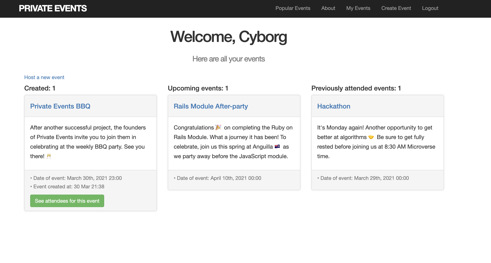

## Project Name: Private Events

### Objective:
To put in practice the main concepts of Associations in rails through an app similar to Eventbrite



## Features

> The front end ( `http://localhost:3000/` ) displays the list of all events, categorized by upcoming and past ones.
> Only signed-in users can register to events.
> The nav bar lets user [Join](#), [Sign In](#), look at the [Popular Events](#) and [Logout](#), and when Signed in the user can see the [Create Event](#) and [My Events](#) options.
> Every signed-in user can invite other users to an event.
> Only upcoming events show the option to invite users.
> After an event was successfully created, the user gets redirected to the event's show page.
> In the event's show page the user can see the list of all the attendees.

## Prerequisites
- Ruby
- Rails
- SQLite3
- Node.js
- Yarn

## Getting Started
- Open your terminal - Windows: `Win + R`, then type `cmd` | Mac: `Command + space`, then type `Terminal`
- Navigate to a directory of your choosing using the `cd` command
- Run this command in your OS terminal: `git clone git@github.com:george-swift/private-events.git` to get a copy of the project.
- Navigate to the project's directory using the `cd` command
- Install dependencies running `bundle install`
- Run migrations to get the databases using: `rails db:migrate`
- Execute `rails s` to fire up the server
- Visit `http://localhost:3000/` to get into the app in your browser
- The user can interact with the blog using the link in the nav bar. To sign up, they can use the `Become a member` link
- To terminate the server, enter `Ctrl + C` in your terminal


## Testing & Troubleshooting
- Run rails test to run all the tests
- If the user runs the server and gets any `webpacker` related errors, check if the following dependency is in `config/webpack/environment.js`. Add it otherwise and run the server again:

```
  const webpack = require('webpack')
  environment.plugins.append(
  'Provide',
  new webpack.ProvidePlugin({
  $: 'jquery',
  jQuery: 'jquery',
  Popper: ['popper.js', 'default']
  })
  )
  ```

## Authors

👤  &nbsp; **Miguel Ricardo Gomez**
- GitHub: [@MiguelArgentina](https://github.com/MiguelArgentina)
- Twitter: [@Qete_arg](https://twitter.com/Qete_arg)
- LinkedIn: [Miguel Ricardo Gomez](https://www.linkedin.com/in/miguelricardogomez/)

👤 &nbsp; **Ubong George**
- GitHub: [@george-swift](https://github.com/george-swift)
- Twitter: [@\_\_pragmaticdev](https://twitter.com/__pragmaticdev)

## Acknowledgments

Ruby on Rails Guide for technical information on how to be productive with Rails

## Show your support

Give a :star:️ &nbsp; if you like this project!

## License

Available as open source under the terms of the [MIT License](https://opensource.org/licenses/MIT).

